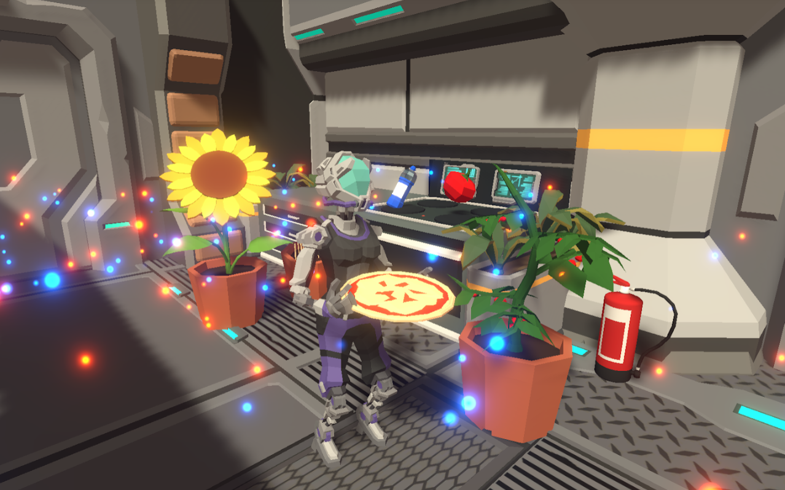

[Game]
Code Bread

Code Bread is a cooperative top-down management game set on a spaceship in which two players try to bake and deliver as many pizzas as possible while dealing with various environmental factors.
Developed together with three fellow students as part of the 'Computer Games Laboratory 2020' practical course of TUM.

Links:

[Project Website](https://wiki.tum.de/display/gameslab2020/Team+Callstack+Overflow+2)

[Trailer](https://youtu.be/ZcPtcbBLNzg)

